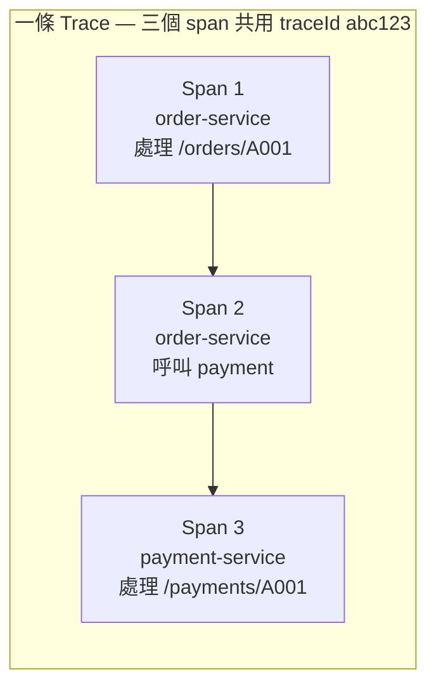
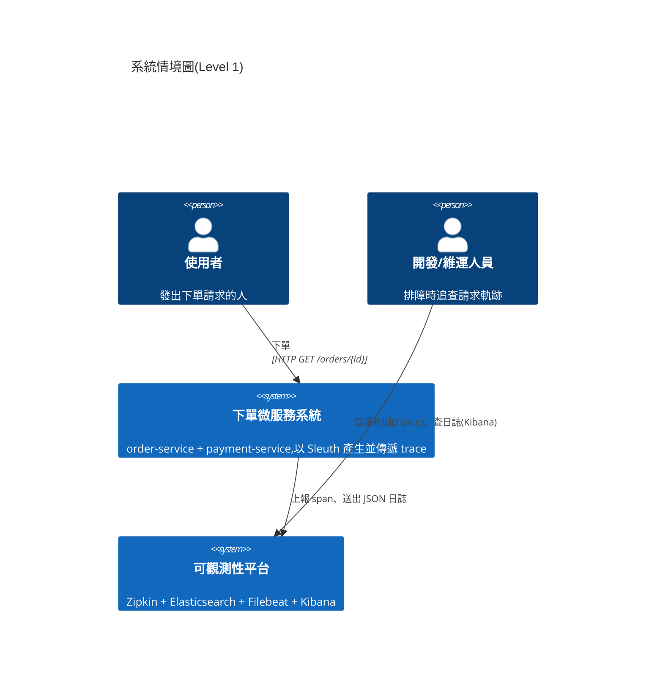
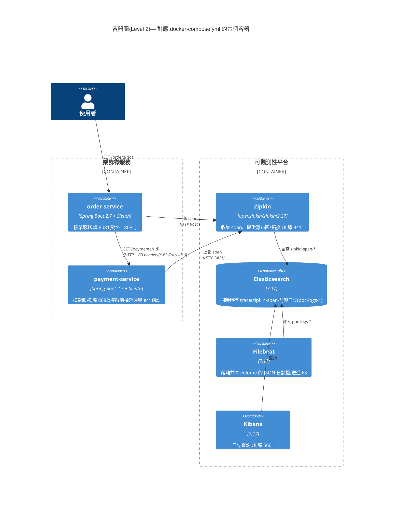
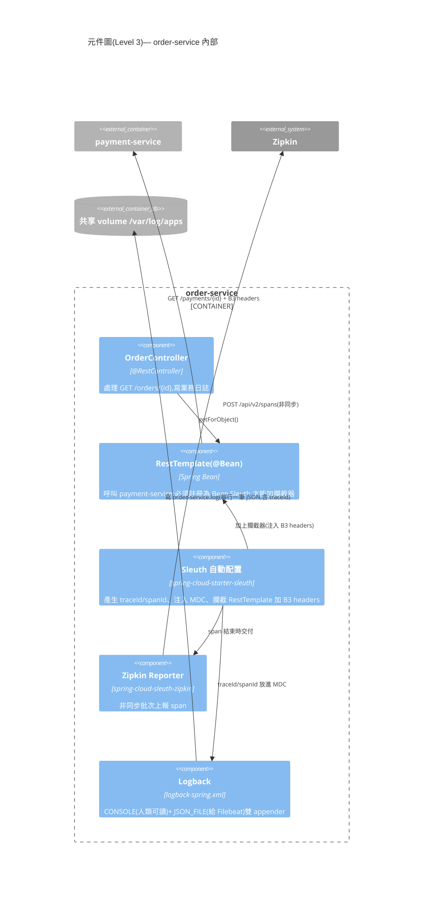
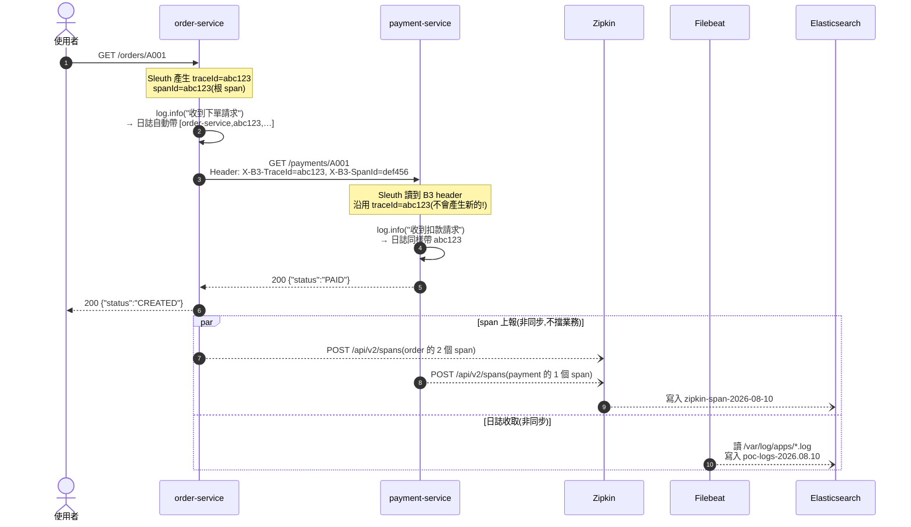
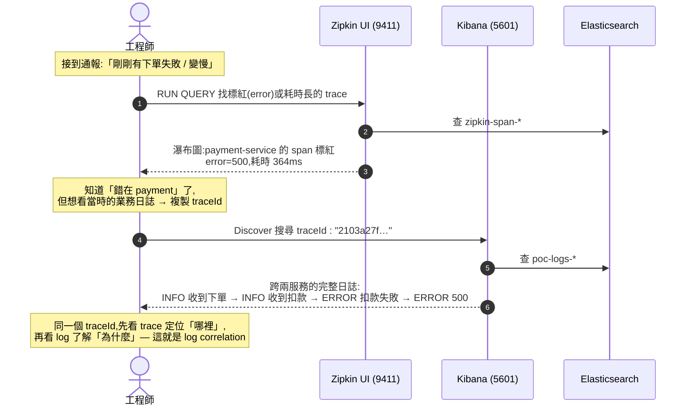
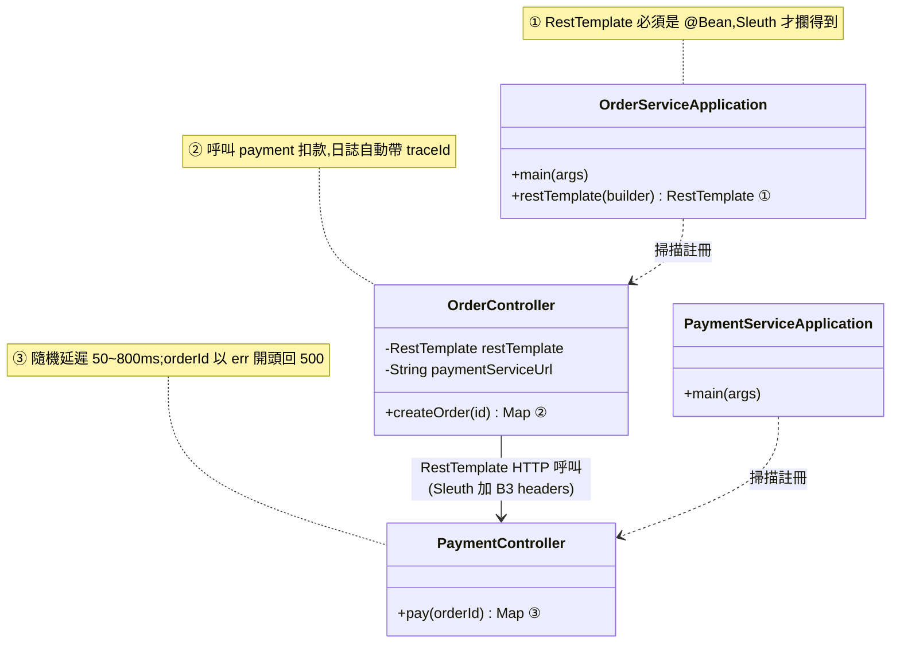

# Spring Boot 2 微服務鏈路追蹤 PoC

**Sleuth + Zipkin(儲存後端 = Elasticsearch)+ Kibana + Filebeat log correlation**

## 架構

```
                    HTTP GET /orders/{id}
  使用者 ──────────> order-service (8081)
                          │
                          │ RestTemplate(Sleuth 自動注入 B3 headers)
                          ▼
                    payment-service (8082)

  兩服務的 span  ──HTTP──> Zipkin (9411) ──> Elasticsearch (zipkin-span-*)
  兩服務的 JSON log ──Filebeat──> Elasticsearch (poc-logs-*)

  Zipkin UI  : 瀑布圖 / 服務依賴拓撲(讀 ES)
  Kibana     : 以 traceId 過濾跨服務日誌(log correlation)
```

## PoC 的核心精神(先懂這三件事)

微服務把一個系統拆成多個獨立服務後,**「一個請求出了問題,到底卡在哪個服務?」**
變得很難回答——每個服務只看得到自己的日誌。本 PoC 用三個概念解決這件事:

1. **分散式追蹤(Distributed Tracing)**
   每個請求進入系統時產生一個全鏈路唯一的 **traceId**;
   請求途經的每一段工作(收到請求、呼叫下游…)各是一個 **span**(有自己的 spanId)。
   一條 trace = 一棵 span 樹,畫出來就是 Zipkin 的瀑布圖。

2. **Context 傳遞(B3 Propagation)**
   traceId 不會自己「飛」到下游服務——Sleuth 在 HTTP 呼叫時自動加上
   `X-B3-TraceId` / `X-B3-SpanId` 等 header,下游收到後**沿用同一個 traceId**。
   這就是為什麼 order-service 與 payment-service 的 span 能被串成同一條 trace。

3. **日誌關聯(Log Correlation)**
   Sleuth 同時把 traceId 塞進日誌框架的 MDC,讓**每一行日誌都自動帶 traceId**。
   日誌與 trace 存進同一個 Elasticsearch 後,拿著一個 traceId 就能:
   在 Zipkin 看「**慢在哪、錯在哪**」→ 在 Kibana 看「**當時發生了什麼**」。



> 上圖:一個請求產生一條 trace,包含 3 個 span,全部共用同一個 traceId。

## 架構圖解(C4 Model)

[C4 Model](https://c4model.com/) 是描述軟體架構的分層方法:像地圖一樣**逐層放大**——
Level 1 看系統與外界的關係,Level 2 看系統內有哪些容器(可部署單元),
Level 3 再放大看單一容器內的元件。

### Level 1:系統情境圖(System Context)

> 誰在用這個系統?系統跟哪些外部系統互動?



**白話**:使用者打 API 下單;系統默默把「這個請求經過了誰、花了多久、留下什麼日誌」
送到可觀測性平台;出問題時,工程師去平台查,不必登入每台機器翻日誌。

### Level 2:容器圖(Container)

> 系統內有哪些可獨立部署的單元(容器)?彼此怎麼溝通?



**白話**:
- 左半邊(業務)只管做生意:order 收單後呼叫 payment 扣款。
- 右半邊(觀測)不參與業務:span 走 HTTP 進 Zipkin、日誌檔由 Filebeat 撿走,
  **兩條路殊途同歸都存進 Elasticsearch**——這正是能用同一個 traceId 交叉查詢的關鍵。
- 業務服務完全不知道 ES/Kibana 存在,觀測元件掛了也不影響下單(解耦)。

### Level 3:元件圖(Component)— 放大 order-service

> 單一容器內部有哪些元件?Sleuth 到底「魔法」在哪裡?



**白話**:業務程式碼(Controller)完全沒寫任何追蹤邏輯——
Sleuth 靠「攔截」達成一切:攔 HTTP 進出加 header、攔日誌塞 traceId、攔 span 結束送 Zipkin。
唯一的規矩是 **RestTemplate 必須是 @Bean**,直接 `new RestTemplate()` Sleuth 就攔不到,
trace 到 order-service 就斷了(這是實務上最常見的踩雷點)。

## UML 動態視圖

### 循序圖 1:一個請求的完整旅程(trace 如何產生與傳遞)



**看懂重點**:
- 步驟 4 的 **B3 header 是整條鏈路的靈魂**——沒有它,兩個服務的 span 就是兩條孤兒 trace。
- span 上報與日誌收取都是**非同步**的(par 區塊),追蹤系統慢了、掛了都不影響下單回應。

### 循序圖 2:排障動線(出問題時工程師怎麼查)



### 類別圖:兩個服務的程式結構(刻意極簡)



**白話**:整個 PoC 的業務程式碼只有 4 個類別、零追蹤程式碼——
所有觀測能力都來自 pom.xml 的兩個依賴(`starter-sleuth` + `sleuth-zipkin`)
與 logback 設定。**這就是本 PoC 的精神:可觀測性是基礎設施,不該入侵業務邏輯。**

## 系統需求

- Docker + Docker Compose
- 記憶體至少 4GB 可用(ES 1GB heap + 其餘容器)

## 啟動

```bash
docker compose up -d --build
# 首次 build 需下載 Maven 依賴,約 3~5 分鐘
docker compose ps          # 確認全部 healthy / running
```

## 驗證步驟

### 1. 產生流量

```bash
# 正常請求(產生跨兩服務的 trace)
curl http://localhost:8081/orders/A001
curl http://localhost:8081/orders/A002

# 錯誤請求(orderId 以 err 開頭 → payment-service 回 500)
curl http://localhost:8081/orders/err001

# 批次打流量,方便看延遲分布
for i in $(seq 1 20); do curl -s http://localhost:8081/orders/B$i > /dev/null; done
```

### 2. Zipkin UI 看鏈路(http://localhost:9411)

- 點 **RUN QUERY** → 可看到每筆 trace,展開後是瀑布圖:
  `order-service` 的 span 包含 `payment-service` 的子 span,可見各段耗時
- err 開頭的請求會標紅,點入可看到 error tag
- **Dependencies** 頁籤 → 服務依賴拓撲圖(order → payment)

> 注意:storage 為 Elasticsearch 時,Dependencies 需另跑聚合任務才有資料:
> ```bash
> docker run --rm --network sleuth-zipkin-es-poc_default \
>   -e STORAGE_TYPE=elasticsearch -e ES_HOSTS=http://elasticsearch:9200 -e ES_INDEX=zipkin \
>   openzipkin/zipkin-dependencies:2.7
> # 正式環境建議以 cron 每日執行
> ```

### 3. 確認 trace 資料真的存在 Elasticsearch

```bash
curl 'http://localhost:9200/_cat/indices/zipkin*?v'
# 應看到 zipkin-span-yyyy-MM-dd 索引

curl 'http://localhost:9200/zipkin-span-*/_search?size=1&pretty'
```

### 4. Kibana log correlation(http://localhost:5601)

1. **Stack Management → Index Patterns** → 建立 `poc-logs-*`(time field: `@timestamp`)
2. **Discover** → 任選一筆 log,複製其 `traceId` 欄位值
3. 搜尋列輸入 `traceId : "<剛複製的值>"`
   → 同一請求在 **order-service 與 payment-service 的所有日誌**被串在一起,
   這就是跨服務的請求軌跡追查

### 5. 交叉驗證(Tracing ↔ Logging 關聯)

在 Zipkin 找一筆慢的 trace,複製其 trace id,到 Kibana 用同一 id 過濾——
可以看到該請求的完整業務日誌,這是排障時最實用的動線。

## 關鍵設定說明

| 檔案 | 重點 |
|---|---|
| `*/pom.xml` | `spring-cloud-starter-sleuth`(產生/傳遞 traceId)+ `spring-cloud-sleuth-zipkin`(上報 span) |
| `*/application.yml` | `sampler.probability: 1.0`(PoC 全採樣)、`propagation.type: B3` |
| `OrderServiceApplication.java` | **RestTemplate 必須註冊為 @Bean**,Sleuth 才會加攔截器傳遞 trace context |
| `logback-spring.xml` | Console pattern 帶 `%X{traceId}`;JSON appender 讓 traceId 成為 ES 可查欄位 |
| `docker-compose.yml` | Zipkin `STORAGE_TYPE=elasticsearch` → trace 存進 ES |
| `filebeat/filebeat.yml` | `json.keys_under_root: true` 讓 traceId 直接成為文件根欄位 |

## 測試結果

執行 `./e2e-test.sh`(端對端自動化測試,2026-08-10,macOS Apple Silicon + Podman):

| # | 測試項目 | 結果 |
|---|---|---|
| T1 | order-service `/actuator/health` = UP | ✅ PASS |
| T2 | payment-service `/actuator/health` = UP | ✅ PASS |
| T3 | Zipkin health = UP 且 storage 為 Elasticsearch | ✅ PASS |
| T4 | Elasticsearch cluster health = green/yellow | ✅ PASS |
| T5 | Kibana `/api/status` = 200 | ✅ PASS |
| T6 | `GET /orders/{id}` 回應 CREATED + PAID(跨服務呼叫成功) | ✅ PASS |
| T7 | `GET /orders/err*` 回應 HTTP 500(錯誤情境如設計) | ✅ PASS |
| T8 | Zipkin 單一 traceId 的 trace 跨 order/payment 兩服務 | ✅ PASS |
| T9 | Zipkin error trace 帶 error tag | ✅ PASS |
| T10 | 依賴拓撲 order-service → payment-service 存在 | ✅ PASS |
| T11 | ES 索引有資料(zipkin-span-* 99 筆、poc-logs-* 72 筆) | ✅ PASS |
| T12 | ES 以 traceId 查日誌,涵蓋兩個服務(log correlation) | ✅ PASS |
| T13 | Kibana 以 traceId 過濾命中跨服務日誌 4 筆 | ✅ PASS |

**合計:13 / 13 全數通過**。完整驗證過程(含發現並修正的 4 個問題)見 [VALIDATION.md](VALIDATION.md)。

> 注意:本環境 order-service 對外埠為 **18081**(主機 8081 被既有服務占用),
> 測試腳本已使用 18081;若你的環境 8081 可用,可將 docker-compose.yml 與腳本改回。

## 生產環境調整建議

1. **採樣率**:`sampler.probability` 改 `0.1`(10%),或評估 tail-based sampling
2. **上報解耦**:`spring.zipkin.sender.type` 改 `kafka`,避免 Zipkin 短暫故障影響應用
3. **索引生命週期**:對 `zipkin-span-*` 與 `poc-logs-*` 設定 ILM(trace 建議保留 7~14 天)
4. **ES 安全性**:開啟 `xpack.security`,Zipkin/Filebeat 補上帳密
5. **資源配置**:`ES_INDEX_SHARDS`/`REPLICAS` 依叢集規模調整(PoC 為 1/0)
6. **升級路徑**:Sleuth 在 Spring Boot 3 已由 Micrometer Tracing 取代;
   若有升級計畫,propagation 可先改 `W3C` 與 OTel 生態接軌

## 清理

```bash
docker compose down -v    # -v 一併刪除 ES 資料與 log volume
```
